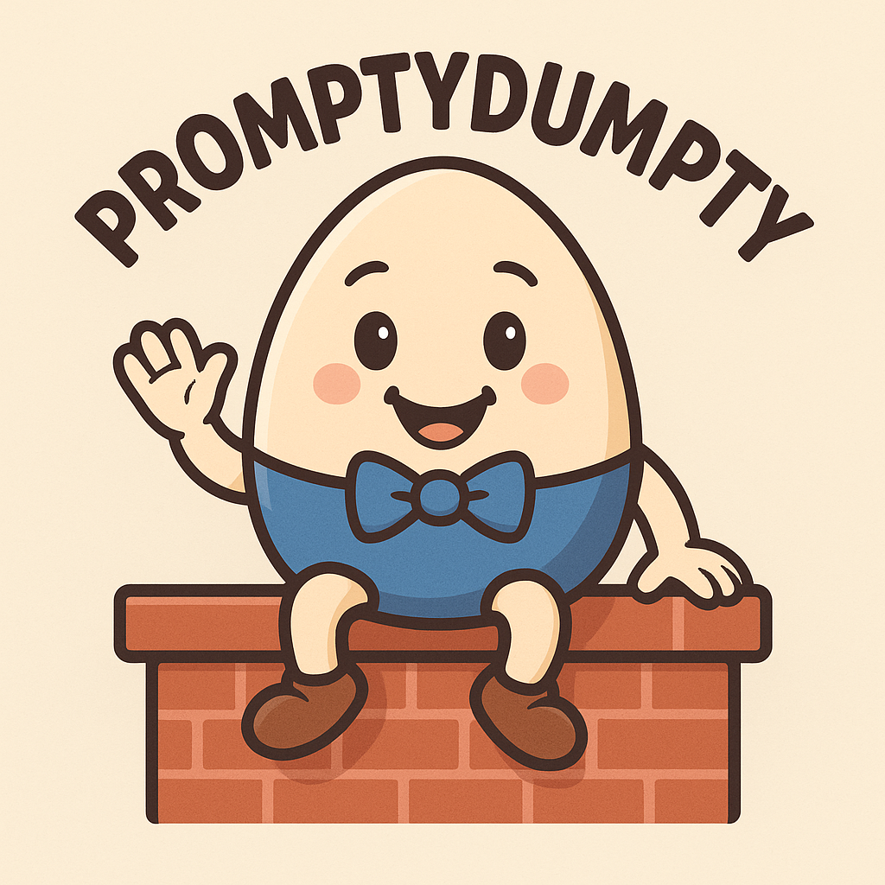

# PromptyDumpty



A lightweight, universal package manager for AI agent artifacts (prompts, instructions, rules, workflows, etc.).

## What is it?

PromptyDumpty lets you install and manage prompt packages across different AI coding assistants like GitHub Copilot, Claude, Cursor, Gemini, Windsurf, and more.

## Why?

- **Share prompts easily**: Package and distribute your team's prompts
- **Works everywhere**: One package works with multiple AI agents
- **Simple**: Just YAML files and Git repos, no complex setup
- **Safe**: Clean installation and removal, clear tracking

## Quick Start

```bash
# Initialize in your project
prompty-dumpty init

# Install a package
prompty-dumpty install https://github.com/org/my-prompts

# List installed packages
prompty-dumpty list

# Update packages
prompty-dumpty update --all

# Remove a package
prompty-dumpty uninstall my-prompts
```

## How it works

1. **Auto-detects** your AI agent (checks for `.github/prompts/`, `.claude/commands/`, etc.)
2. **Installs** package files to the right directories
3. **Tracks** everything in a lockfile for easy management
4. **Organizes** files by package name for clean removal

## Package Structure

```
my-package/
├── prompty-dumpty.yaml    # Package manifest
├── README.md
└── artifacts/             # Your prompts, rules, etc.
    ├── commands/
    ├── rules/
    └── workflows/
```

## Creating Packages

Define what your package provides in `prompty-dumpty.yaml`:

```yaml
name: my-workflows
version: 1.0.0
description: Custom development workflows
agents:
  - copilot
  - claude
  - cursor

artifacts:
  - name: code-review
    source: artifacts/commands/code-review.md
    target: prompts/
  
  - name: testing-guide
    source: artifacts/rules/testing.md
    target: rules/
```

## Documentation

See [REQUIREMENTS.md](REQUIREMENTS.md) for detailed specifications.

## Status

⚠️ **In Development** - Requirements phase. Not yet implemented.

## License

MIT
